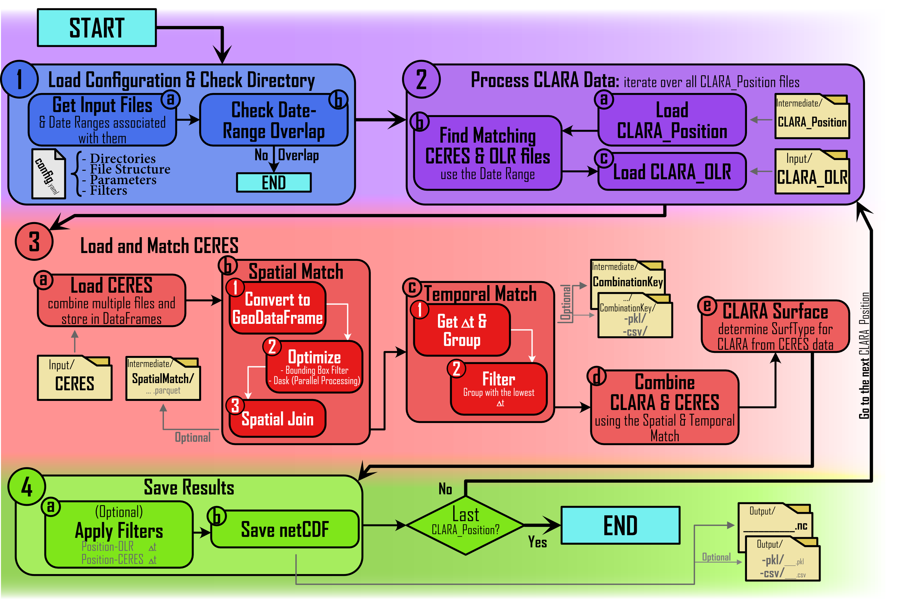

# CLARA-CERES-Comparison-Pipeline

*A data analysis pipeline for comparing Outgoing Longwave Radiation (OLR) measurements from the CLARA instrument (PMOD/WRC) and the CERES satellite dataset.*

## Overview

This project was developed as part of a student research project at **PMOD/WRC** (Physikalisch-Meteorologisches Observatorium Davos / World Radiation Center).

The goal of this pipeline is to compare **Outgoing Longwave Radiation (OLR)** measurements from two sources:

- **CLARA** — a newly developed instrument at PMOD/WRC
- **CERES** — the Clouds and the Earth’s Radiant Energy System, a long-established satellite-based Earth observation program by NASA

By aligning and processing data from these sources, the pipeline enables:
- Spatial and temporal matching of datasets
- Statistical comparison and validation of OLR values
- Output of merged datasets and visual diagnostics

The pipeline is written in Python and is fully modular, allowing researchers to adapt it for additional datasets or future versions of CLARA. The folder structure and file paths are customizable via a configuration file (`config.yaml`).

## Pipeline Overview

The pipeline consists of two main modules:

1. **Module 1 – Get CLARA FOV coordinates**  
   This module computes the CLARA FOV coordinates/footprint based on NorSat position and orientation data.

2. **Module 2 – Match CLARA & CERES**  
   This module performs spatial and temporal alignment of CLARA and CERES data.

### Module 1: get_coordinates_file()


### Module 2: combine_CLARA_CERES()


### Functions Overview
<table>
<thead>
<tr>
<th colspan="2"><strong>Function</strong></th>
<td><strong>Calls</strong></td>
<td><strong>Called by</strong></td>
</tr>
</thead>
<tbody>

<tr><td colspan="4" align="center"><strong>File: <code>math_and_conversion.py</code></strong></td></tr>

<tr><td>MC.1</td><td><code>safe_float_conversion()</code></td><td>-</td><td>FH.5</td></tr>
<tr><td>MC.2</td><td><code>latitude_to_colatitude()</code></td><td>-</td><td>CO.3,4</td></tr>
<tr><td>MC.3</td><td><code>colatitude_to_latitude()</code></td><td>-</td><td>-</td></tr>
<tr><td>MC.4</td><td><code>longitude_to_positive()</code></td><td>-</td><td>CO.3,4</td></tr>
<tr><td>MC.5</td><td><code>positive_longitude_to_standard()</code></td><td>-</td><td>-</td></tr>
<tr><td>MC.6</td><td><code>clara_radiance_conversion()</code></td><td>-</td><td>FH.5</td></tr>
<tr><td>MC.7</td><td><code>create_quaternion()</code></td><td>-</td><td>CO.4</td></tr>
<tr><td>MC.8</td><td><code>get_satellite_eci_coordinates()</code></td><td>-</td><td>CO.4</td></tr>
<tr><td>MC.9</td><td><code>get_satellite_pointing_vector()</code></td><td>-</td><td>CO.4</td></tr>
<tr><td>MC.10</td><td><code>compute_view_zenith_angle()</code></td><td>-</td><td>CO.4</td></tr>
<tr><td>MC.11</td><td><code>extract_polygon_coords()</code></td><td>-</td><td>OP.1</td></tr>
<tr><td>MC.12</td><td><code>extract_polygon_from_multipolygon()</code></td><td>-</td><td>CO.3</td></tr>

<tr><td colspan="4" align="center"><strong>File: <code>file_handling.py</code></strong></td></tr>

<tr><td>FH.1</td><td><code>extract_file_dates()</code></td><td>-</td><td>M.II</td></tr>
<tr><td>FH.2</td><td><code>filter_files_by_date_range()</code></td><td>-</td><td>M.II</td></tr>
<tr><td>FH.3</td><td><code>create_filename()</code></td><td>-</td><td>M.I, II</td></tr>
<tr><td>FH.4</td><td><code>load_config()</code></td><td>-</td><td>M.I, II</td></tr>
<tr><td>FH.5</td><td><code>read_norsat_position()</code></td><td>MC.1</td><td>M.I</td></tr>
<tr><td>FH.6</td><td><code>get_clara_olr()</code></td><td>MC.6</td><td>M.II</td></tr>
<tr><td>FH.7</td><td><code>load_and_merge_ceres()</code></td><td>-</td><td>M.II</td></tr>

<tr><td colspan="4" align="center"><strong>File: <code>coordinates.py</code></strong></td></tr>

<tr><td>CO.1</td><td><code>get_clara_fov_lonlat()</code></td><td>-</td><td>CO.3,4</td></tr>
<tr><td>CO.2</td><td><code>generate_fov_cone_vectors()</code></td><td>-</td><td>CO.3</td></tr>
<tr><td>CO.3</td><td><code>get_fov_fooprint()</code></td><td>MC.2,4,12; CO.1,2</td><td>CO.4</td></tr>
<tr><td>CO.4</td><td><code>get_coordinates()</code></td><td>MC.2,4,7,8,9,10; CO.1,3</td><td>M.I</td></tr>
<tr><td>CO.5</td><td><code>calculate_local_time_after_midnight()</code></td><td>-</td><td>M.I</td></tr>

<tr><td colspan="4" align="center"><strong>File: <code>matching_and_merging.py</code></strong></td></tr>

<tr><td>MM.1</td><td><code>match_ceres_clara_positions()</code></td><td>-</td><td>M.II</td></tr>
<tr><td>MM.2</td><td><code>get_nearest_time_deltas()</code></td><td>-</td><td>MM.3</td></tr>
<tr><td>MM.3</td><td><code>filter_ceres_clara_by_time()</code></td><td>MM.2</td><td>M.II</td></tr>
<tr><td>MM.4</td><td><code>add_ceres_data_to_clara()</code></td><td>-</td><td>M.II</td></tr>
<tr><td>MM.5</td><td><code>get_clara_surface()</code></td><td>-</td><td>M.II</td></tr>

<tr><td colspan="4" align="center"><strong>File: <code>output.py</code></strong></td></tr>

<tr><td>OP.1</td><td><code>save_netCDF()</code></td><td>MC.11</td><td>M.II</td></tr>

<tr><td colspan="4" align="center"><strong>File: <code>modules.py</code></strong></td></tr>

<tr><td>M.I</td><td><code>create_coordinates_files()</code></td><td>FH.3,4,5; CO.4,5</td><td>-</td></tr>
<tr><td>M.II</td><td><code>combine_CLARA_CERES()</code></td><td>FH.1,2,3,4,6,7; MM.1,3,4,5; OP.1</td><td>-</td></tr>

</tbody>
</table>

## Installation
### 1. Clone the repository
```bash
git clone https://github.com/your-username/CLARA-CERES-Comparison-Pipeline.git
cd CLARA-CERES-Comparison-Pipeline
```
### 2. Install the Required Python Packages
```bash
pip install -r requirements.txt
```

## Usage Instructions
### 1. Setup the Configuration File
Before running the pipeline, you need to adjust the **configuration file** (`config.yaml`) to point to your local data files and set parameters.
### 2. Verify Input Files
Ensure that all required input files are available in the directories specified in the `config.yaml` file.
### 3. Run the Pipeline
Once you have configured the `config.yaml` file and ensured the input files are available, you can rull the full pipeline using the `run_all.py` script. This will execute the in the configuration selected modules.
```bash
python run_all.py
```

## Output Files
The main output of the pipeline are monthly netCDF files of the merged data. Additionally, the `config.yaml` file can be configured to save intermediate results as `.pkl`, `.csv`, `.parquet` files.

### netCDF
The netCDF file contains the following data.
<table>
<thead>
<tr>
<th>Variable</th>
<th>Units</th>
<th>Dimensions</th>
</tr>
</thead>
<tbody>

<tr>
<td><code>time</code><br><i>Time of observation (UTC)</i></td>
<td>days since 1970-01-01</td>
<td>(time,)</td>
</tr>

<tr>
<td><code>SurfType</code><br><i>Index of the most prevalent surface types</i></td>
<td>-</td>
<td>(SurfType,)</td>
</tr>

<tr><td colspan="3" align="center"><strong><code>Header/</code></strong></td></tr>

<tr>
<td><code>number_of_measurements</code><br><i>The total count of CLARA measurements included in this netCDF file.</i></td>
<td>-</td>
<td>-</td>
</tr>

<tr>
<td><code>clara_max_view_zenith_angle</code><br><i>The maximum view zenith angle, in degrees, that is allowed for CLARA observations in this dataset.</i></td>
<td>degrees</td>
<td>-</td>
</tr>

<tr>
<td><code>num_footprint_vertices</code><br><i>The number of vertices used to define the CLARA footprint area.</i></td>
<td>-</td>
<td>-</td>
</tr>

<tr>
<td><code>clara_fov_angle</code><br><i>The half-angle, in degrees, of the CLARA field of view (FOV) cone. This defines the angular extent of the satellite's observation region.</i></td>
<td>degrees</td>
<td>-</td>
</tr>

<tr>
<td><code>ceres_matching_time_bin_size</code><br><i>The time threshold, in minutes, used to group CERES matches into bins.</i></td>
<td>minutes</td>
<td>-</td>
</tr>

<tr>
<td><code>filter_pos_olr_time_diff</code><br><i>The maximum allowed time difference, in seconds, between the CLARA position time and the corresponding OLR measurement time.</i></td>
<td>seconds</td>
<td>-</td>
</tr>

<tr>
<td><code>filter_clara_ceres_time_diff</code><br><i>The maximum allowed mean time difference, in minutes, between the CLARA position time and the corresponding CERES observation time.</i></td>
<td>minutes</td>
<td>-</td>
</tr>

<tr><td colspan="3" align="center"><strong><code>Time_and_Position/</code></strong></td></tr>

<tr>
<td><code>instrument_fov_longitude</code><br><i>Geodetic longitude of the instrument's surface field of view, expressed in degrees east from 0 to 360. This represents the surface intercept location observed at each time step.</i></td>
<td>degrees_east</td>
<td>(time,)</td>
</tr>

<tr>
<td><code>instrument_fov_latitude</code><br><i>Geodetic latitude of the instrument's surface field of view, expressed in degrees north from -90 to 90. This location corresponds to the surface intercept point observed at each time step.</i></td>
<td>degrees_north</td>
<td>(time,)</td>
</tr>

<tr>
<td><code>instrument_fov_colatitude</code><br><i>Geodetic colatitude of the instrument's surface field of view, expressed in degrees from \ang{0} at the North Pole to \ang{180} at the South Pole. This is complementary to latitude and may be used in spherical coordinate systems.</i></td>
<td>degrees</td>
<td>(time,)</td>
</tr>

<tr>
<td><code>instrument_fov_footprint</code><br><i>Geodetic coordinates (longitude, latitude) of the surface footprint vertices defining the field of view at each time step.</i></td>
<td>degrees</td>
<td>(time, footprint_vertices, lon_lat)</td>
</tr>

<tr>
<td><code>UTC_time</code><br><i>Time of each observation expressed in UTC, as days since 1970-01-01 00:00:00. This variable follows CF conventions and can be interpreted using standard calendar handling.</i></td>
<td>days since 1970-01-01</td>
<td>(time,)</td>
</tr>

<tr>
<td><code>local_time</code><br><i>Local time at the surface observation point, expressed in decimal hours after local midnight (0–24). This value is derived from UTC time and the observation longitude.</i></td>
<td>hours</td>
<td>(time,)</td>
</tr>

<tr>
<td><code>solar_zenith_angle</code><br><i>Solar zenith angle at the geodetic location and time of observation, expressed in degrees.</i></td>
<td>degrees</td>
<td>(time,)</td>
</tr>

<tr><td colspan="3" align="center"><strong><code>Radiance/</code></strong></td></tr>

<tr>
<td><code>longwave_radiance_clara</code><br><i>Top-of-atmosphere outgoing longwave radiance measured by the CLARA instrument, expressed in watts per square meter per steradian (Wm<sup>-2</sup>sr<sup>-1</sup>). This represents the upwelling thermal emission in the longwave spectral range at the time and location of observation.</i></td>
<td>W m<sup>-2</sup> sr<sup>-1</sup></td>
<td>(time,)</td>
</tr>

<tr>
<td><code>longwave_radiance_ceres</code><br><i>Mean top-of-atmosphere outgoing longwave radiance from CERES observations, spatially and temporally matched to the CLARA observation. Values are expressed in watts per square meter per steradian (Wm<sup>-2</sup>sr<sup>-1</sup>).</i></td>
<td>W m<sup>-2</sup> sr<sup>-1</sup></td>
<td>(time,)</td>
</tr>

<tr><td colspan="3" align="center"><strong><code>Surface_Map/</code></strong></td></tr>

<tr>
<td><code>surface_igbp_type</code><br><i>International Geosphere-Biosphere Programme (IGBP) land cover type indices present within the instrument's field of view at each observation time. Each index corresponds to a specific land cover class (e.g., evergreen needleleaf forest, grassland, urban).</i></td>
<td>-</td>
<td>(time, SurfType)</td>
</tr>

<tr>
<td><code>surface_igbp_type_coverage</code><br><i>{Percentage of each International Geosphere-Biosphere Programme (IGBP) land cover type present within the instrument's field of view at each observation time. Coverage values are expressed as percentages (0 to 100%) of the observed area corresponding to each surface type index.</i></td>
<td>percent</td>
<td>(time, SurfType)</td>
</tr>

<tr><td colspan="3" align="center"><strong><code>CLARA_Satellite/</code></strong></td></tr>

<tr>
<td><code>subsatellite_longitude</code><br><i>{Longitude of the surface point directly beneath the CLARA satellite, expressed in degrees east (0–360). This value represents the location on the Earth's surface where the satellite is directly overhead at each time step.</i></td>
<td>degrees_east</td>
<td>(time,)</td>
</tr>

<tr>
<td><code>subsatellite_colatitude</code><br><i>Colatitude of the surface point directly beneath the CLARA satellite, expressed in degrees (0–180), where 0° corresponds to the North Pole and 180° corresponds to the South Pole. This value represents the location on the Earth's surface where the satellite is directly overhead at each time step.</i></td>
<td>degrees</td>
<td>(time,)</td>
</tr>

<tr>
<td><code>satellite_position_eci</code><br><i>Position of the satellite in ECI (Earth-Centered Inertial) coordinates at each time step. The position is provided as a 3-component vector, with values for the X, Y, and Z coordinates, expressed in kilometers (km). These components define the satellite's location relative to the Earth's center.</i></td>
<td>km</td>
<td>(time, VectorXYZ)</td>
</tr>

<tr>
<td><code>satellite_pointing_vector_eci</code><br><i>Direction in which the satellite is pointing, represented as a unit vector in ECI coordinates at each time step. The vector defines the orientation of the satellite relative to the Earth's center, with components in the X, Y, and Z directions. The vector is normalized to unit length.</i></td>
<td>-</td>
<td>(time, VectorXYZ)</td>
</tr>

<tr>
<td><code>view_zenith_angle</code><br><i>The angle between the satellite's viewing vector (or pointing vector) and the nadir vector, expressed in degrees. This represents the zenith angle of the instrument's view relative to the Earth's surface, where 0° corresponds to nadir (directly below the satellite), and larger values indicate a more oblique view.</i></td>
<td>degrees</td>
<td>(time,)</td>
</tr>

<tr><td colspan="3" align="center"><strong><code>CERES_Satellite/</code></strong></td></tr>

<tr>
<td><code>mean_solar_zenith_angle</code><br><i>The average solar zenith angle at the surface during matched CERES observations, expressed in degrees.</i></td>
<td>degrees</td>
<td>(time,)</td>
</tr>

<tr>
<td><code>mean_relative_azimuth_angle</code><br><i>The average relative azimuth angle at the surface during matched CERES observations, expressed in degrees. The relative azimuth angle represents the angle between the Sun-satellite plane and the satellite-observation direction.</i></td>
<td>degrees</td>
<td>(time,)</td>
</tr>

<tr>
<td><code>mean_view_zenith_angle</code><br><i>The average view zenith angle at the surface during matched CERES observations, expressed in degrees.</i></td>
<td>degrees</td>
<td>(time,)</td>
</tr>

<tr><td colspan="3" align="center"><strong><code>Matching_Information/</code></strong></td></tr>

<tr>
<td><code>ceres_match_times</code><br><i>Timestamps of the CERES instrument observations that correspond to each CLARA observation, expressed as days since 1970-01-01 00:00:00 (UNIX epoch). These times are aligned to the matched CLARA observations.</i></td>
<td>days since 1970-01-01</td>
<td>(time, match)</td>
</tr>

<tr>
<td><code>num_ceres_matches</code><br><i>The total number of CERES observations that correspond to each CLARA observation. This value indicates how many CERES data points are spatially and temporally matched to the CLARA observation.</i></td>
<td>-</td>
<td>(time,)</td>
</tr>

<tr>
<td><code>mean_ceres_match_time_diff</code><br><i>The average time difference, in seconds, between the CERES observations and the corresponding CLARA observation.</i></td>
<td>seconds</td>
<td>(time,)</td>
</tr>

<tr>
<td><code>olr_measurement_time</code><br><i>The time, in days since 1970-01-01 00:00:00, of the CLARA outgoing longwave radiation (OLR) measurement that corresponds to the matched CLARA position time.</i></td>
<td>days since 1970-01-01</td>
<td>(time,)</td>
</tr>

<tr>
<td><code>olr_position_time_diff</code><br><i>The time difference, in seconds, between the CLARA outgoing longwave radiation (OLR) measurement time and the corresponding CLARA position time.</i></td>
<td>seconds</td>
<td>(time,)</td>
</tr>

</tbody>
</table>

## Further Reading
For more information on how to use or adapt the pipeline for your specific needs, please refer to the [Research Report](references/research_report.pdf) associated with this project, which provides a deeper explanation of the methodology and implementation.


